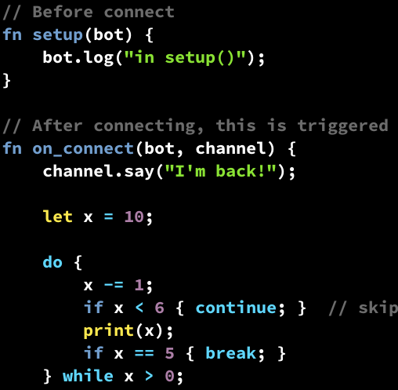

# vim-rhai

Vim/Neovim syntax plugin for the [Rhai scripting language](https://rhai.rs/).

<!-- TOC generated using the command `npx doctoc README.md -->
<!-- START doctoc generated TOC please keep comment here to allow auto update -->
<!-- DON'T EDIT THIS SECTION, INSTEAD RE-RUN doctoc TO UPDATE -->
- [Installation](#installation)
- [TODO](#todo)
- [License](#license)
- [Contribution](#contribution)

<!-- END doctoc generated TOC please keep comment here to allow auto update -->

[](screenshot.png)


## Installation

To install using [Vim-Plug](https://github.com/junegunn/vim-plug):

```vim
" add this line to your .vimrc file
Plug 'rhaiscript/vim-rhai'
```

To install using [Vundle](https://github.com/gmarik/vundle):

```vim
" add this line to your .vimrc file
Plugin 'rhaiscript/vim-rhai'
```

To install using [pathogen.vim](https://github.com/tpope/vim-pathogen):

```sh
git clone https://github.com/rhaiscript/vim-rhai.git ~/.vim/bundle/vim-rhai
```

## TODO

The following needs to be adressed:

- Fix indentation (currently based on cindent, but broken with object literals)
- Add object syntax `#{}`
- Add more built in functions


## License

Licensed under either of

 * Apache License, Version 2.0
   ([LICENSE-APACHE](LICENSE-APACHE) or http://www.apache.org/licenses/LICENSE-2.0)
 * MIT license
   ([LICENSE-MIT](LICENSE-MIT) or http://opensource.org/licenses/MIT)

at your option.

## Contribution

Unless you explicitly state otherwise, any contribution intentionally submitted
for inclusion in the work by you, as defined in the Apache-2.0 license, shall be
dual licensed as above, without any additional terms or conditions.
